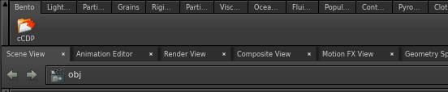

Bento
====================

## Description
Bento is a toolset for houdini.

## Feature

### Shelf tool

* [Cache Dependency](doc/cacheDependency.md)

## Install
1. Clone or Download this repository to your place you want to download.
2. Place this repository to houdini-accessible place.
3. Open **houdini.env**.
4. Add `HOUDINI_PATH` in the **houdini.env** file.
  * Ex: `HOUDINI_PATH = &:/anywhere/you/want/to/install/Bento` (Linux)
  * To add `&` is important to keep original Houdini Path.

* Recommended to install with `git clone` and `git submodule init` & `git submodule update` or `git clone --recursive` to download this repository and depended submodules, to keep tracking updates and also downgrade installed this repository.
