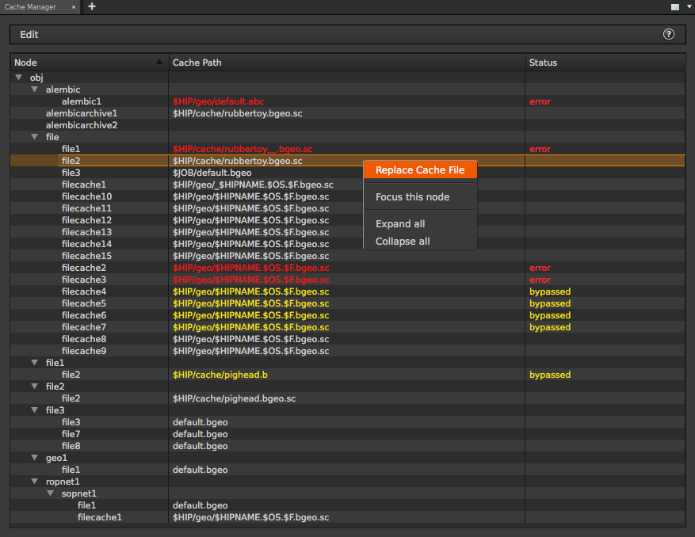

# Cache Manager

## Feature

* List cache nodes scatted everywhere in Houdini scene.
* Filter Read/Write and Multi type of nodes.
* This tool is supported only above on Houdini 15.0.

## How to

* Update view with "Ctrl+R"("⌘+R" on Mac) or "F5".
* RMB click over each items and show a menu.
* Click "Replace Cache File" in RMB Menu for opening a file select dialog.
* Click "Focus this node" in RMB Menu for selecting the node you RMB clicked.
* View > "Toggle R/W" show Read/Write type of nodes.
* View > "Both Nodes" or "Read Nodes Only" or "Write Nodes Only" filter displayed nodes by Read/Write type.

## Supported Nodes

### SOP
| Node               | Parameter     |
|:-------------------|:--------------|
| Alembic            | File Name     |
| Dop I/O            | Geometry File |
| File               | Geometry File |
| File Cache         | Geometry File |
| MDD                | MDD File      |
| ROP Alembic Driver | Alembic File  |
| ROP Output Driver  | Output File   |
| Table Import       | File          |

### DOP
| Node       | Parameter    |
|:-----------|:-------------|
| Gas Up Res | Low Res File |

### ROP
| Node     | Parameter    |
|:---------|:-------------|
| Alembic  | Alembic File |
| Geometry | Output File  |

### SHOP
| Node                    | Parameter     |
|:------------------------|:--------------|
| Delayed Load Procedural | Geometry File |

### Object
| Node            | Parameter     |
|:----------------|:--------------|
| Alembic Archive | File name     |
| Dop Network     | Geometry File |
