# Color Nodes

## Feature

### Shelf Tool

Color nodes when shelf-tool button clicked.

> Note: If you have already selected nodes, this affects only for them.

### OnCreated Script

Color nodes when nodes are created.

## Detail

### Colors by File Type

| Gray               | Sample                                             |
|:-------------------|:---------------------------------------------------|
| null               |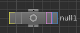   |
| merge              |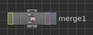  |
| output             | |

| Blue:  Disk Output | Sample                                                        |
|:-------------------|:--------------------------------------------------------------|
| rop_geometry       |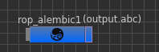       |
| rop_alembic        |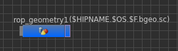      |
| heightfield_output |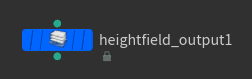|

| Yellow: Disk Input  | Sample                                                       |
|:--------------------|:-------------------------------------------------------------|
| file                |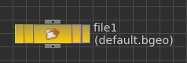             |
| filecache           |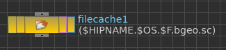        |
| filemerge           |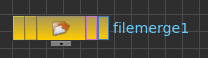        |
| alembic             |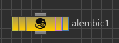          |
| alembicxform        |     |
| heightfield_file    |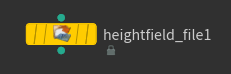 |

| Purple Blue: Dop I/O | Sample                                                      |
|:---------------------|:------------------------------------------------------------|
| dopimport            |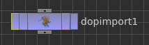       |
| dopimportfield       |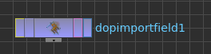  |
| dopimportrecords     |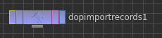|
| dopio                |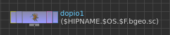           |

| Green: Geometry Fetch | Sample                                                   |
|:----------------------|:---------------------------------------------------------|
| object_merge          |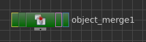 |

### Colors by Object Context

| Object Context     | Sample                                                     |
|:-------------------|:-----------------------------------------------------------|
| cam                |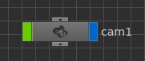            |
| geo                |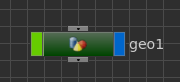            |
| ropnet             |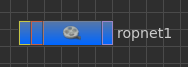         |
| alembicarchive     |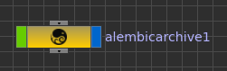 |
